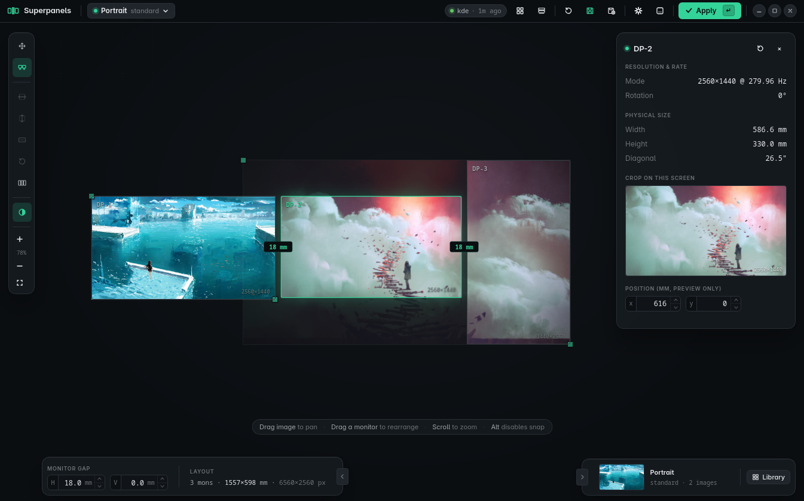
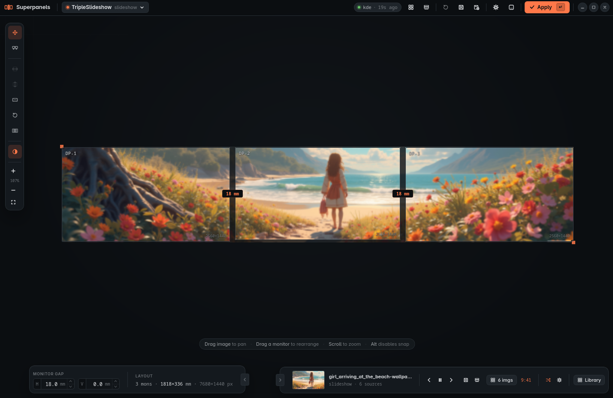
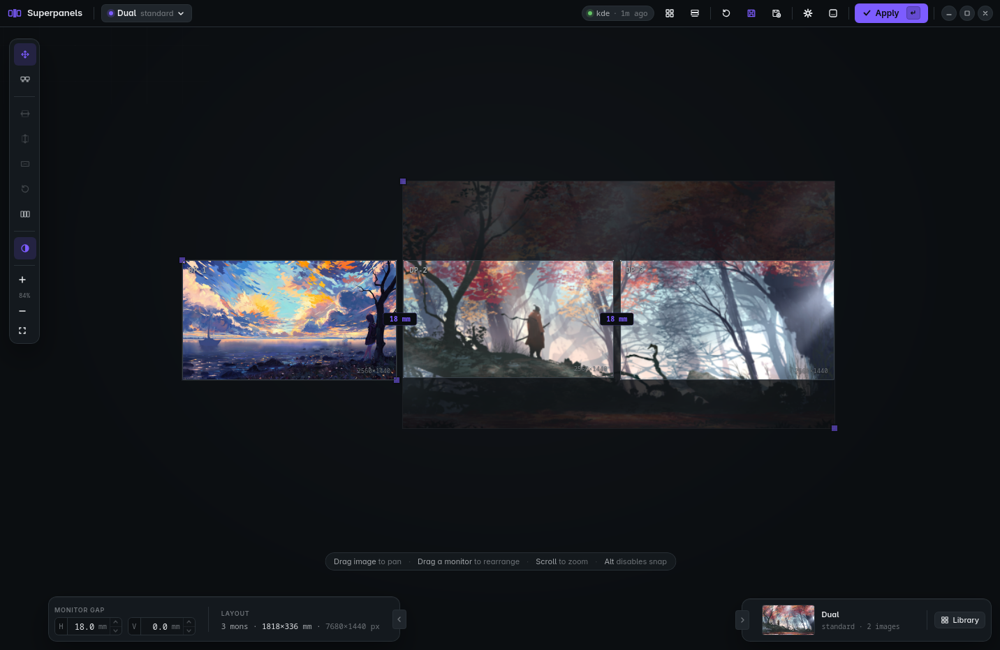

<div align="center">

# Superpanels

**A Linux wallpaper manager built for multi-monitor desks.**
It treats your monitors as what they physically are — panels at real positions in real space, with real gaps between them — and crops and scales a single image across them so the picture stays continuous to your eye.

[](https://github.com/AlexSandilands/superpanels/actions/workflows/ci.yml)
[](#licence)


<br />



<br /><br />

<table>
<tr>
<td width="50%"></td>
<td width="50%"></td>
</tr>
</table>

</div>

## What it is

Most wallpaper tools think in pixels: they stretch one image edge-to-edge across a virtual framebuffer, ignoring that there's a centimetre or two of plastic between your panels. The result is a panorama with a seam — the horizon jumps where the bezels are.

Superpanels thinks in **millimetres**. You tell it how big each monitor is and how much gap sits between them, and it maps your image onto the physical desktop plane *including* those gaps — so the slice of the picture that falls "behind" a bezel is simply not shown, the way it would be if you were looking through three windows onto one scene. Pan, zoom, and rotate the image on a live canvas that mirrors your real layout, then apply.

It does this for a single still image, for free-positioned multi-image collages, and for folder-driven slideshows on a schedule. There's a GUI for arranging things by hand and a CLI for headless or scripted use.

- **Bezel-aware spanning** — one image across many monitors, continuous across the physical gap, with per-monitor mixed orientation and resolution handled.
- **Free placement** — drag, zoom, and rotate on a scaled, bezel-accurate preview of your actual desk; stack multiple images as layers.
- **Folder slideshows** — rotate through folders on an interval or schedule, with shuffle, recent-history suppression, and per-image crop overrides that stick.
- **Profiles** — save a whole canvas setup (placements, gaps, image) as a named mode and switch between them, manually or on a clock.
- **Compositor coverage** — KDE, GNOME, Sway, Hyprland, X11/feh, plus a custom-command escape hatch.
- **One binary, no daemon required** — the CLI applies in-process; run the daemon only when you want the slideshow timer, file watcher, and tray to persist.

Primary target is Arch / CachyOS on KDE Wayland, but it runs anywhere the compositors above do.

## Install

The install script pulls the latest release, drops the CLI, daemon, and GUI into place, and registers the app icon — on any glibc Linux distro.

```sh
curl -fsSL https://raw.githubusercontent.com/AlexSandilands/superpanels/main/install.sh | sh
```

Uninstall the same way:

```sh
curl -fsSL https://raw.githubusercontent.com/AlexSandilands/superpanels/main/install.sh | sh -s -- --uninstall
```

Your config under `~/.config/superpanels` is left untouched on uninstall.

**Options** (after `| sh -s --`): `--version <v>` to pin a release, `--prefix <dir>` to install somewhere else (e.g. `~/.local` for no sudo). The GUI needs **WebKitGTK 4.1** at runtime — `webkit2gtk-4.1` on Arch, `webkit2gtk4.1` on Fedora, `libwebkit2gtk-4.1-0` on Debian/Ubuntu.

**Other ways in:**

- **Arch (AUR):** `yay -S superpanels` — one package, all three binaries.
- **Native packages:** each release also attaches a `.deb`, `.rpm`, and `.AppImage` for the GUI, plus `SHA256SUMS`. Grab one from the [releases page](https://github.com/AlexSandilands/superpanels/releases) and `sudo dnf install ./…rpm` / `sudo apt install ./…deb`, or just run the AppImage.
- **From source:** see [Building from source](#building-from-source) below.

## Features

### The canvas, spanning, and bezel correction

The GUI is a scaled model of your real desk. Each monitor sits at its physical position; the number on the gap between two panels (`18 mm` in the screenshots) is the **monitor gap** — bezel plus air-gap — and it's the thing that makes spanning look right. Drop an image and it covers the monitor union; drag it to pan, scroll to zoom, rotate it, and the per-monitor crop updates live. Select a monitor to open the inspector: resolution and refresh, rotation, physical size in millimetres and inches, and a preview of exactly what that screen will show.

The math lives in physical mm, not pixels — see [`docs/reference/layout-math.md`](./docs/reference/layout-math.md) for why that's the only way to get a seam-free panorama.

### Monitors and physical size

Detection (via `kscreen-doctor`, Wayland, X11, …) gives Superpanels your monitors' pixel modes and positions, but **not** their physical size — no compositor reliably exposes that. You supply it once, per monitor, either through the GUI's first-run flow or the CLI:

```sh
# From the panel's advertised diagonal + aspect ratio…
superpanels monitor configure DP-1 --diagonal 27in --aspect 16:9

# …or give the millimetres directly.
superpanels monitor configure DP-1 --mm 597x336
```

Monitors are keyed by a **stable id** (the KDE per-output UUID, or a hash of make/model/serial elsewhere), not by names like `DP-1` that shuffle across reboots and dock plugs. Until a monitor has a physical size, profiles that need it stay disabled rather than guessing.

### Profiles

A profile is *the mode you're in*, not a one-shot command: it bundles the whole canvas state — per-monitor placements, gaps, and the image setup — captured against a specific monitor topology. Two shapes:

- **Standard** — one or more free-positioned image layers on the canvas. A single spanned image is just a one-layer Standard; add more and each monitor composites the layers that overlap it, so one picture can slice across two screens while another fills a third.
- **Slideshow** — a rotating set drawn from folders and/or hand-picked images (see below).

Each profile remembers the topology it was authored against. Plug in a different set of monitors and the profile greys out instead of applying something wrong, with a repair flow to re-author it. Manage them from the tray, the GUI's profile switcher, or the CLI:

```sh
superpanels profile list
superpanels profile apply work
superpanels profile duplicate work work-portrait
superpanels profile export work -o work.toml   # portable bundle
superpanels profile import work.toml
```

### Slideshows and library

A slideshow source is a mixed list of **live folders** (rescanned every rotation, so new files join automatically) and **individual images**. Timing, ordering, and history are per-profile:

```toml
[profile.body.source.config]
interval_secs       = 1800       # rotate every 30 min
sort                = "shuffle"   # or sequential
recent_history_size = 10         # don't repeat the last 10
on_start            = "resume"    # pick up where it left off
```

Untuned images are cover-fit to your layout at their own aspect ratio; any image you hand-tune on the canvas gets a **per-image override** that's keyed by its path and resolved by the daemon at apply time — so its crop sticks even with the GUI closed. Mixed a set authored at one fixed resolution? Flip `uniform_layout` (the GUI's "apply to all") to force every image into the same placement.

The **library** is a SQLite-backed index of your wallpaper roots (`$XDG_DATA_HOME/superpanels/library.db`) with thumbnails and tags, scanned and kept fresh by the daemon. It's the dock along the bottom of the canvas — drag from it straight onto a monitor or into a slideshow.

When a slideshow is running, control it from anywhere:

```sh
superpanels next     # advance
superpanels prev     # step back
superpanels pause    # hold the timer
superpanels resume
```

### Scheduling

Switch profiles by the clock, independent of slideshow timing — daily at a time, or on a cron expression:

```sh
superpanels schedule add night --daily 20:00
superpanels schedule add work  --cron "0 9 * * 1-5"
superpanels schedule list
superpanels schedule disable 2
```

Conflicting rules (two firing the same minute) are rejected at save time; on daemon start, the most recent past trigger for today catches up. A master pause toggle (mirrored in the tray) suspends every schedule at once.

### Backends

Superpanels detects and drives your compositor's wallpaper mechanism automatically, or you can force one:

```toml
[backend]
prefer = "auto"   # auto | kde | gnome | sway | hyprland | feh | custom
```

`custom` runs a command of your own with `{image_N}` / `{monitor_N}` placeholders, for setups none of the built-ins cover. Backend details are in [`docs/reference/backends.md`](./docs/reference/backends.md).

### UI controls at a glance

- **Canvas gestures:** *drag the image to pan · drag a monitor to rearrange · scroll to zoom · hold Alt to disable snapping* — and the zoom / fit controls sit on the left rail.
- **Monitor inspector:** click a monitor to see and nudge its mode, rotation, physical size, and live crop preview.
- **Monitor gap:** the `H` / `V` millimetre fields, bottom-left, set the bezel+air gap that drives spanning.
- **Profile switcher:** top-left, shows the active profile and its mode (standard / slideshow); each profile carries its own accent colour.
- **Status + apply:** the top bar shows the active backend and when it last applied (`kde · 1m ago`); **Apply** (or <kbd>Enter</kbd>) pushes the current canvas to your desktop, **Save** persists it to the profile.
- **Library dock:** bottom-right; opens the indexed wallpaper grid with slideshow playback controls when a slideshow profile is active.

## CLI

The CLI runs without the daemon (in-process fallback), so one-shot applies work anywhere. It talks to the daemon when one is running, for the slideshow timer / watcher / tray.

| Command | What it does |
|---|---|
| `superpanels set <IMAGE…>` | Set wallpaper from one or more images; auto-fits to the monitor union. `--dry-run` to preview crops, `--save-as <NAME>` to capture a profile, `--monitor NAME=PATH` to pin per-monitor, `--backend <NAME>` to force one. |
| `superpanels detect` | Print the detected monitor layout. `--json` for machine output, `--debug` to see which detectors were tried. |
| `superpanels config` | Print the resolved configuration as TOML. |
| `superpanels monitor configure <ID>` | Add/update a monitor's physical size (`--diagonal` + `--aspect`, or `--mm`). |
| `superpanels profile <list\|apply\|show\|delete\|rename\|duplicate\|export\|import>` | Manage saved profiles. |
| `superpanels schedule <list\|add\|remove\|enable\|disable\|pause\|resume>` | Manage clock-driven profile switches. |
| `superpanels next` / `prev` / `pause` / `resume` | Drive a running slideshow. |

Global flags: `-v` / `-vv` (debug / trace logging), `--quiet`, `--config <PATH>` for an alternate config file, `--no-daemon` to force in-process. Full help on any command with `--help`.

```sh
# A typical first run.
superpanels monitor configure DP-1 --diagonal 27in --aspect 16:9
superpanels monitor configure DP-2 --diagonal 27in --aspect 16:9
superpanels set panorama.jpg --dry-run     # check the crops
superpanels set panorama.jpg --save-as desk
```

## Configuration

Everything lives in `$XDG_CONFIG_HOME/superpanels/config.toml` (plus state and the library DB under `$XDG_STATE_HOME` / `$XDG_DATA_HOME`). A missing or empty config is valid — every section has defaults. The GUI writes it for you; it's hand-editable too, and validated on load *and* before every save, with the exact field path on any error (so a bad edit never bricks startup or wipes your current wallpaper). The daemon hot-reloads on `SIGHUP`; the GUI's Save reloads over IPC.

The full schema — profiles, monitors, slideshows, schedules, overrides — is documented in [`docs/reference/configuration.md`](./docs/reference/configuration.md).

## Building from source

Rust workspace (`crates/superpanels-{core,cli,daemon,gui}`) with a Svelte 5 frontend in `ui/`. Stable toolchain, Node for the GUI frontend.

```sh
git clone https://github.com/AlexSandilands/superpanels.git
cd superpanels

# CLI + daemon only:
cargo build --release -p superpanels-cli -p superpanels-daemon

# GUI (build the frontend first; tauri-build embeds it):
npm --prefix ui ci && npm --prefix ui run build
cargo build --release -p superpanels-gui
```

Tauri OS prerequisites, the dev/HMR flow, and the WebKitGTK Wayland note are in [CONTRIBUTING.md](./CONTRIBUTING.md). Packaging and release mechanics live in [`packaging/README.md`](./packaging/README.md).

## Documentation

| Read this when | Doc |
|---|---|
| You want the layout / monitor-gap math | [`docs/reference/layout-math.md`](./docs/reference/layout-math.md) |
| You're touching display detection | [`docs/reference/displays.md`](./docs/reference/displays.md) |
| You're touching a backend | [`docs/reference/backends.md`](./docs/reference/backends.md) |
| You want the config schema | [`docs/reference/configuration.md`](./docs/reference/configuration.md) |
| You're working on the security / IPC surface | [`docs/reference/security.md`](./docs/reference/security.md) |
| You're contributing code | [CONTRIBUTING.md](./CONTRIBUTING.md) and [`docs/contributing/`](./docs/contributing/) |
| You're tagging a release | [`packaging/README.md`](./packaging/README.md) |

## Licence

Dual-licensed under either [Apache License, Version 2.0](./LICENSE-APACHE) or [MIT License](./LICENSE-MIT) at your option. Contributions are accepted under the same terms.
